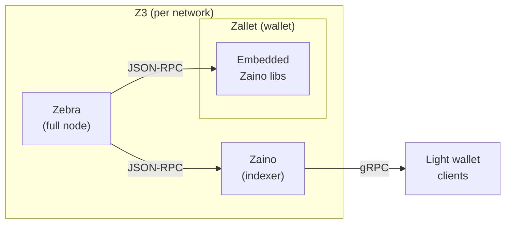

# Z3: a Zcash node platform

Z3 runs **Zebra** (full node), **Zaino** (indexer), and **Zallet** (wallet) with Docker Compose. Downstream services can attach through the documented network, ports, and authentication surfaces.

## Prerequisites

- [Docker Engine](https://docs.docker.com/engine/install/) with [Docker Compose](https://docs.docker.com/compose/install/) (v2.24.4+)
- [rage](https://github.com/str4d/rage/releases) for generating Zallet encryption keys (`brew install rage` on macOS, or download a release)
- `openssl` for generating the Zaino TLS certificate (pre-installed on macOS and most Linux distros)
- Git for cloning the repository

> [!TIP]
> **Want to verify the stack works before committing to mainnet?** Skip to [Running regtest](#running-regtest). It boots in seconds, mines blocks on demand, and exercises the same services. Operators who confirm regtest works rarely hit setup issues on mainnet.

## Quick start

Z3 runs as one of three Compose projects: `z3-mainnet`, `z3-testnet`, `z3-regtest`. The instructions below walk through mainnet; for the other networks see [Networks](#networks).

Zebra has to sync the entire chain before Zaino and Zallet can serve clients. Expect **24-72 hours** on a fresh mainnet install (2-12 hours on testnet, instant on regtest). The two-phase flow below starts Zebra alone, waits for the sync, then brings up the rest.

```bash
git clone https://github.com/ZcashFoundation/z3 && cd z3

# 1. First-run setup. Idempotent: creates local config files, generates the
#    Zallet identity, and generates the shared TLS cert.
./scripts/setup-network.sh mainnet

# 2. Start Zebra alone.
docker compose --env-file .env.mainnet up -d zebra

# 3. Wait for sync. The helper polls /ready every 30s and prints progress.
./scripts/check-zebra-readiness.sh

# 4. Bring up Zaino + Zallet now that Zebra is synced.
docker compose --env-file .env.mainnet up -d
```

Pre-built images for all three services are pulled automatically. No build step or submodule init needed.

> [!NOTE]
> The per-network config files at `config/<network>/zallet.toml` and `config/<network>/zaino.toml` are local and gitignored. `setup-network.sh` copies them from tracked `.example` templates on first run, so edits to your live `.toml` files never conflict with repository updates. After pulling a new version, diff your copy against the template:
>
> ```bash
> diff config/mainnet/zallet.toml config/mainnet/zallet.toml.example
> ```

> [!IMPORTANT]
> Step 3 is not optional. Running `up -d` before Zebra reaches `/ready` causes Zaino and Zallet to restart in a loop until the sync catches up. The poller exits 0 only when Zebra is synced.

> [!TIP]
> **Apple Silicon:** Zebra runs natively on arm64. Zaino and Zallet are pinned to amd64 and run under emulation by default (their workload is light); to build them native arm64 instead, see [Platform configuration (ARM64)](#platform-configuration-arm64). The optional zcashd profile is amd64-only. See [docs/faq.md](docs/faq.md) for other behaviors that look like bugs but aren't.

## Networks

Z3 ships three networks. Pick by use case; each runs as a separate Compose project with isolated volumes and host ports, so mainnet and testnet can run concurrently on the same host without collisions.

| Network | Use case | Initial sync |
|---------|----------|--------------|
| **Mainnet** | Production: real Zcash blockchain, real funds | 24-72 hours |
| **Testnet** | Integration testing against the public test network | 2-12 hours |
| **Regtest** | Local development: instant blocks, no peers, no sync wait | Seconds |

Each network has its own setup command and bring-up sequence below. Don't `docker compose up` until you've run the matching setup step, otherwise the bind mounts fail because the live config files have not been created yet.

### Running testnet

```bash
./scripts/setup-network.sh testnet
docker compose --env-file .env.testnet up -d zebra

# Wait for sync. Pass the testnet health port to the poller.
./scripts/check-zebra-readiness.sh 18080

docker compose --env-file .env.testnet up -d
```

### Running regtest

Regtest uses an overlay (`docker-compose.regtest.yml`) that adds the rpc-router service, switches from cookie auth to username/password, and adjusts healthchecks for a peerless network.

```bash
# One-shot init: file setup + identity + TLS + boots Zebra + mines 2 blocks.
# Idempotent; subsequent runs skip steps already done.
./scripts/regtest-init.sh

docker compose --env-file .env.regtest up -d
```

After the first init, just the `up -d` line is enough on subsequent boots.

See [docs/regtest.md](docs/regtest.md) for test commands (curl, grpcurl) and the full workflow reference.

### Optional zcashd comparator

`zcashd` is available behind an opt-in Compose profile for local comparison tests. It is not part of the default stack, uses a separate data volume, and starts with public P2P disabled. All three networks support it:

```bash
docker compose --env-file .env.mainnet --profile zcashd up -d zcashd
docker compose --env-file .env.testnet --profile zcashd up -d zcashd
docker compose --env-file .env.regtest --profile zcashd up -d zcashd
```

Default image pin is the `${Z3_ZCASHD_IMAGE:-...}` fallback in `docker-compose.yml`. Default RPC credentials: `zebra` / `zebra`; override with `ZCASHD_RPCUSER` and `ZCASHD_RPCPASSWORD`. Container RPC stays on `38232`; host ports are `60232` (mainnet), `61232` (testnet), and `62232` (regtest).

### Monitoring stack

Prometheus, Grafana, Jaeger, and AlertManager are available behind a Compose profile. Zebra's Prometheus endpoint is enabled by default on the internal `zebra:9999` scrape target.

Then start with the profile:

```bash
docker compose --env-file .env.mainnet --profile monitoring up -d
docker compose --env-file .env.testnet --profile monitoring up -d
docker compose --env-file .env.regtest --profile monitoring up -d
```

Default monitoring host ports are globally unique across the three Z3 networks; the full per-network matrix lives in [`z3-contract.yaml`](z3-contract.yaml) under `networks.<name>.ports`. Each pin is overridable: `Z3_GRAFANA_PORT`, `Z3_PROMETHEUS_PORT`, `Z3_ALERTMANAGER_PORT`, `Z3_JAEGER_UI_PORT`, `Z3_JAEGER_OTLP_GRPC_PORT`, `Z3_JAEGER_OTLP_HTTP_PORT`, `Z3_JAEGER_SPANMETRICS_PORT`.

## Architecture



**Zebra** syncs and validates the Zcash blockchain. **Zaino** provides a lightwalletd-compatible gRPC interface for light wallet clients. **Zallet** embeds Zaino's indexer libraries internally and connects directly to Zebra's JSON-RPC; it does not use the standalone Zaino service.

Image pins live as `${VAR:-tag}` defaults in `docker-compose.yml`; override any pin at runtime with `Z3_ZEBRA_IMAGE`, `Z3_ZAINO_IMAGE`, `Z3_ZALLET_IMAGE`, or `Z3_ZCASHD_IMAGE`. Per-image platform support is declared in [`z3-contract.yaml`](z3-contract.yaml) under `image_platforms:`. Upstream sources: [Zebra](https://github.com/ZcashFoundation/zebra), [Zaino](https://github.com/zingolabs/zaino), [Zallet](https://github.com/zcash/wallet), [zcashd](https://github.com/zcash/zcash).

## Service endpoints

Published host ports are chosen per `.env.<network>` so all Z3 networks can coexist on one host. The full per-network matrix lives in [`z3-contract.yaml`](z3-contract.yaml) under `networks.<name>.ports`.

| Service | Endpoint shape | Env var |
|---------|----------------|---------|
| Zebra RPC | `http://localhost:<port>` | `Z3_ZEBRA_HOST_RPC_PORT` |
| Zebra health | `http://localhost:<port>/ready` | `Z3_ZEBRA_HOST_HEALTH_PORT` |
| Zebra indexer | `localhost:<port>` | `Z3_ZEBRA_HOST_INDEXER_PORT` |
| Zaino gRPC (TLS) | `localhost:<port>` | `Z3_ZAINO_HOST_GRPC_PORT` |
| Zaino JSON-RPC | `http://localhost:<port>` | `Z3_ZAINO_HOST_JSON_RPC_PORT` |
| Zallet RPC | `http://localhost:<port>` | `Z3_ZALLET_HOST_RPC_PORT` |
| zcashd RPC (profile zcashd) | `http://localhost:<port>` | `Z3_ZCASHD_HOST_RPC_PORT` |

Container ports inside the network follow Zebra's per-network defaults (mainnet uses Zebra's mainnet ports; testnet and regtest use Zebra's testnet ports). Service DNS names inside the network are `zebra`, `zaino`, `zallet`.

## Public contract for downstream services

Downstream services attach to a running Z3 stack via a stable, declared contract. The network names and cookie-auth surfaces are explicit (not subject to Compose's project-prefix behavior).

Identifiers follow the pattern `z3-<network>-<suffix>`. The Compose project name and the external Docker network name are both `z3-<network>` (e.g., `z3-mainnet`). Volumes are `z3-<network>-<suffix>` where the suffix is `chain`, `cookie`, `zaino`, `zallet`, or `zcashd` (profile-gated). The cookie file path inside containers that use cookie auth is `/var/run/auth/.cookie`.

RPC auth differs by network: cookie file (mainnet, testnet) or username/password (regtest). Consumers on regtest should not mount `z3-regtest-cookie` expecting a readable cookie; Zebra does not write one there. The full identifier inventory lives in [`z3-contract.yaml`](z3-contract.yaml).

A mainnet or testnet consumer compose file attaches with:

```yaml
networks:
  z3:
    external: true
    name: z3-testnet
volumes:
  z3-cookie:
    external: true
    name: z3-testnet-cookie
services:
  my-app:
    networks: [z3]
    volumes:
      - z3-cookie:/var/run/auth:ro
    environment:
      ZEBRA_RPC_URL: http://zebra:18232
      ZEBRA_COOKIE_PATH: /var/run/auth/.cookie
```

Regtest disables Zebra cookie auth and uses username/password credentials through the regtest configs and rpc-router. Do not mount `z3-regtest-cookie` expecting a readable `.cookie` file.

See `docs/contract.md` for the full contract and `docs/integrations/` for integration examples.

## Stopping the stack

```bash
docker compose --env-file .env.mainnet down       # stop containers, keep data
docker compose --env-file .env.mainnet down -v    # stop and delete all volumes (full reset)
```

---

## Reference

<details>
<summary><strong>System requirements</strong></summary>

### Minimum

- **CPU:** 2 cores (4+ recommended)
- **RAM:** 4 GB for Zebra alone; 8+ GB for the full stack
- **Disk:** Mainnet ~300 GB, Testnet ~30 GB (SSD strongly recommended)
- **Network:** Reliable internet; initial mainnet sync downloads ~300 GB

### Recommended

- **CPU:** 4+ cores
- **RAM:** 16+ GB
- **Disk:** 500+ GB with room for blockchain growth
- **Network:** 100+ Mbps, ~300 GB/month bandwidth

### Sync times

| Network | First sync | With existing data |
|---------|-----------|-------------------|
| Mainnet | 24-72 hours | Minutes |
| Testnet | 2-12 hours | Minutes |

Based on [Zebra's official requirements](https://zebra.zfnd.org/user/requirements.html).

</details>

<details>
<summary><strong>Setup details</strong></summary>

### Submodules

Pre-built images are used by default. To build from source:

```bash
git submodule update --init --recursive
docker compose --env-file .env.mainnet build
```

### First-run setup (`setup-network.sh`)

`./scripts/setup-network.sh <network>` is idempotent and does everything needed before the first `docker compose up`:

- Copies `config/<network>/zallet.toml.example` -> `config/<network>/zallet.toml` (local, gitignored)
- Copies `config/<network>/zaino.toml.example` → `config/<network>/zaino.toml` (same)
- Generates `config/<network>/zallet_identity.txt` via `rage-keygen` if missing
- Generates `config/tls/zaino.{crt,key}` (self-signed, 1 year) if missing

Subsequent runs print which steps were skipped. Back up `zallet_identity.txt` and the public keys it printed. For production TLS, replace the self-signed cert with one from a trusted CA after the script runs.

### Per-network Zallet config

Zallet config lives at `config/<network>/zallet.toml` (local, gitignored). The tracked `.example` template carries the default. The `[indexer]` section points at the per-network Zebra RPC port (8232 mainnet, 18232 testnet, 18232 regtest). Edit your live `.toml` freely; pulls won't conflict.

To compare your copy against a refreshed template after `git pull`:

```bash
diff config/mainnet/zallet.toml config/mainnet/zallet.toml.example
```

### Platform configuration (ARM64)

Zebra is multi-arch; Docker picks the host's native arch automatically, no override needed. Zaino and Zallet are pinned to `linux/amd64` because their upstream images publish amd64 only. On Apple Silicon those two run under emulation by default; the workload is light enough that this rarely matters.

To run Zaino and Zallet natively on arm64, build them locally from the submodules:

```bash
git submodule update --init --recursive
DOCKER_PLATFORM=linux/arm64 docker compose --env-file .env.mainnet build zaino zallet
docker compose --env-file .env.mainnet up -d
```

The zcashd service is hardcoded `linux/amd64`; under `--profile zcashd` on arm64 hosts it runs through emulation.

</details>

<details>
<summary><strong>Configuration reference</strong></summary>

### Defaults in compose

Every variable in `docker-compose.yml` has a default via `${VAR:-default}`. The stack works with zero configuration files; the per-network env files override only what differs from mainnet.

Precedence (highest wins):

1. Shell environment variables
2. `--env-file <path>` arguments
3. `.env` file values (auto-loaded)
4. Compose file defaults

### Variable naming

Two namespaces keep stack-level settings separate from service-native settings:

| Namespace | Scope | Examples |
|-----------|-------|----------|
| `Z3_*` | Stack-level settings: port matrix, image pins, volume paths, per-service log split, monitoring port matrix | `Z3_NETWORK`, `Z3_ZEBRA_HOST_RPC_PORT`, `Z3_ZEBRA_IMAGE`, `Z3_ZEBRA_RUST_LOG` |
| `ZCASHD_*` | zcashd image entrypoint convention; passed through unchanged | `ZCASHD_RPCUSER`, `ZCASHD_RPCPASSWORD`, `ZCASHD_*_ACTIVATION_HEIGHT` |
| `ZEBRA_*` / `ZAINO_*` | Service-native config-rs vars (double-underscore is config-rs nesting) | `ZEBRA_RPC__ENABLE_COOKIE_AUTH`, `ZEBRA_HEALTH__MIN_CONNECTED_PEERS` |
| `DOCKER_PLATFORM`, `COMPOSE_*`, `RUST_LOG` | Ecosystem / shell standards | `DOCKER_PLATFORM=linux/arm64` |

z3 sets the service-internal vars (`ZEBRA_RPC__LISTEN_ADDR`, `ZAINO_VALIDATOR_SETTINGS__*`, `ZCASHD_RPCBIND`, etc.) inside the compose `environment:` blocks based on the public knobs above. Operators should not set those directly.

### Common overrides

```bash
# Per-service log levels
Z3_ZEBRA_RUST_LOG=debug
Z3_ZAINO_RUST_LOG=debug

# Pin a different image version
Z3_ZEBRA_IMAGE=zfnd/zebra:5.0.0

# Move chain state to an external SSD
Z3_CHAIN_DATA_PATH=/mnt/ssd/zebra-state

# Override zcashd RPC credentials (passed straight to the image)
ZCASHD_RPCUSER=alice
ZCASHD_RPCPASSWORD=hunter2

# Disable Zebra cookie auth (advanced; native Zebra config-rs var)
ZEBRA_RPC__ENABLE_COOKIE_AUTH=false
```

When using the documented `--env-file .env.<network>` commands, put these in the shell environment or pass `.env` as a second `--env-file`; Compose does not auto-load `.env` in that mode. See `.env.example` for the full reference.

</details>

<details>
<summary><strong>Data storage and volumes</strong></summary>

### Docker named volumes (default)

Z3 declares each volume with an explicit `name:` so the external Docker identifier is `${COMPOSE_PROJECT_NAME}-<suffix>`. Volume contents per network:

| Suffix | Contents |
|--------|----------|
| `chain` | Zebra blockchain state (~300 GB mainnet, ~30 GB testnet) |
| `zaino` | Zaino indexer database |
| `zallet` | Zallet wallet database (contains keys) |
| `zcashd` | Optional zcashd comparator chain state |
| `cookie` | RPC authentication cookie for mainnet/testnet (regtest disables cookie auth) |

Example concrete names: `z3-mainnet-chain`, `z3-testnet-cookie`, `z3-regtest-zallet`.

### Local directories (advanced)

For backups, external SSDs, or shared storage, override volume paths in `.env`:

```bash
Z3_CHAIN_DATA_PATH=/mnt/ssd/zebra-state
Z3_ZAINO_DATA_PATH=/mnt/ssd/zaino-data
Z3_ZALLET_DATA_PATH=/mnt/ssd/zallet-data
Z3_ZCASHD_DATA_PATH=/mnt/ssd/zcashd-data
```

Fix permissions before starting:

```bash
./scripts/fix-permissions.sh zebra /mnt/ssd/zebra-state
./scripts/fix-permissions.sh zaino /mnt/ssd/zaino-data
./scripts/fix-permissions.sh zallet /mnt/ssd/zallet-data
./scripts/fix-permissions.sh zcashd /mnt/ssd/zcashd-data
```

Zebra, Zaino, Zallet, and zcashd each run as a specific non-root user. Directories must have correct ownership (set by the script) and `700` permissions. Never use `755` or `777`.

</details>

<details>
<summary><strong>Health checks and sync strategy</strong></summary>

### Two-phase deployment

Zebra's blockchain sync takes hours to days. Docker Compose healthcheck timeouts cannot accommodate this, so the stack uses a two-phase approach:

1. Start Zebra alone: `docker compose --env-file .env.mainnet up -d zebra`
2. Wait for sync: `curl http://localhost:8080/ready` returns `ok`
3. Start the full stack: `docker compose --env-file .env.mainnet up -d`

### Health endpoints

Zebra exposes two endpoints on its health port:

| Endpoint | Returns 200 when | Use for |
|----------|-------------------|---------|
| `/healthy` | Minimum peer connections present | Liveness monitoring, restart decisions |
| `/ready` | Synced within 2 blocks of tip | Production readiness, dependency gating |

### Service dependency chain

```
Zebra (/ready: synced near tip)
  -> Cookie permissions (.cookie readable on cookie-auth networks)
  -> Zaino (gRPC port responding)
  -> Zallet (RPC responding)
```

The default compose gates Zaino and Zallet on Zebra's `/ready` endpoint and on the cookie-permissions sidecar when cookie auth is enabled. For development, copy `docker-compose.override.yml.example` to `docker-compose.override.yml` to switch Zebra gating to `/healthy` (allows services to start during sync, but they may error until Zebra catches up).

### Monitoring sync progress

```bash
curl http://localhost:8080/ready             # "ok" when synced
docker compose --env-file .env.mainnet logs -f zebra
./scripts/check-zebra-readiness.sh           # polls until synced, prints status every 30s
```

### Tuning health checks

Three Zebra healthcheck thresholds are operator-tunable. Defaults live in `docker-compose.yml`; override in `.env`:

```bash
# How far behind tip /ready tolerates (raise during catch-up syncs)
ZEBRA_HEALTH__READY_MAX_BLOCKS_BEHIND=10

# Minimum peers required for /healthy (set 0 for regtest)
ZEBRA_HEALTH__MIN_CONNECTED_PEERS=3

# Make /ready always return 200 on testnet even during sync
ZEBRA_HEALTH__ENFORCE_ON_TEST_NETWORKS=true
```

</details>

## Further reading

- [docs/docker-architecture.md](docs/docker-architecture.md): Compose patterns, overlay merge rules, security hardening rationale
- [docs/regtest.md](docs/regtest.md): regtest environment setup and test commands
- [.env.example](.env.example): every public environment variable with its default
